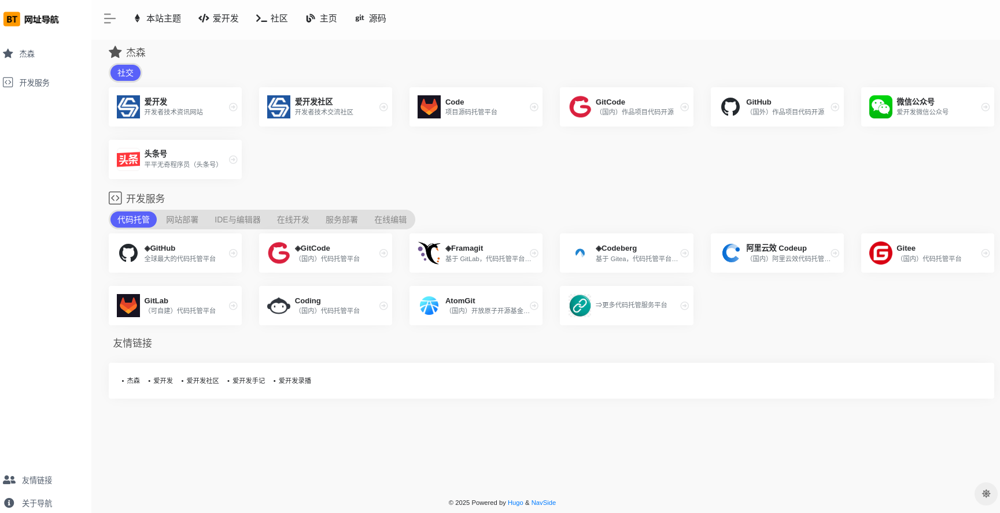

# NavSide

> NavSide 是一个简洁、优雅且高效的 Hugo 网址导航主题

## 特征

- **匡** 字结构主题
- 纯粹、简洁，无搜索、热门新闻等多余的功能
- 支持卡片式切换类目
- 支持 [**Font Awesome 5.15.4**](https://fontawesome.com/v5/search?ic=free) 图标
- 支持 [**Bootstrap Icons 1.11.3**](https://icons.getbootstrap.com/) 图标
- 支持 51.LA 网站统计

## 预览图




## 演示

- 演示网站   
  https://navside.skiy.net
- 本地演示   
```sh
hugo serve --source=exampleSite
```

## 使用教程

1. 创建新项目
```sh
mkdir mynav
cd mynav
git init
```

2. 安装此主题

> 在项目根目录下运行：

```sh
# 添加主题（未添加此主题时）
git submodule add https://github.com/idevsig/navside.git themes/navside

# 首次使用（首次从 Git 拉取代码时）
git submodule update --init --recursive

# 拉取当前主题最新代码
git submodule update --remote themes/navside

# 拉取所有最新主题代码
git submodule foreach git pull origin main
```

3. 复制 `exampleSite`   
```sh
cp -r themes/navside/exampleSite/* .
```

4. 设置数据
```sh
content
├── friendlinks.yml # 友情链接（左下）
├── headers.yml     # 顶部导航（顶部）
└── navsites.yml    # 网址列表 （中间）
```

- `friendlinks.yml` 格式：
```yaml
- title: 杰森
  url: https://i.jetsung.com/
  description: 个人网站    
```

- `headers.yml` 格式：
```yaml
- item: 主页
  icon: fas fa-blog
  link: "https://i.jetsung.com"
  target: _blank 

- item: 源码
  icon: fab fa-git
  list:
    - name: Code
      url: "https://git.jetsung.com/jetsung"
      target: _blank 
```

- `navsites.yml` 格式：
```yaml
- taxonomy: 杰森
  icon: bi bi-star-fill
  list:
    - term: 社交
      links:
        - title: 爱开发
          logo: idev.png
          favicon:
          url: https://www.idev.top/
          description: 开发者技术资讯网站
          qrcode:

- taxonomy: 杰森 # 一级目录
  icon: bi bi-star-fill # 一级目录图标。支持 `Font Awesome` 和 `Bootstrap Icons` 图标
  list: # 列表
    - term: 社交 # 二级目录
      links: 
        - title: 爱开发 # 网站标题
          logo: idev.png # 网站图标名称
          favicon: # 网络上的网站图标网址。若未配置此链接，则网站图标通过网络获取，通过 .deploy.sh 拉取
          url: https://www.idev.top/ # 网站链接
          description: 开发者技术资讯网站 # 网站描述
          qrcode: # 二维码
```

5. *图标保存位置（根据 `config.toml` 的 `logosPath` 参数）
```sh
mkdir -p static/assets/images/logos
```

> 可自行将网站的图标保存至此处。可参考 [`.deploy.sh`](.deploy.sh#L275)，通过 API 方式获取图标。

2. 配置 `config.toml`   
删除 `themesDir` 此行
```sh
sed -i '/themesDir/d' config.toml
```

6. 运行本地测试
```sh
hugo serve
```

7. 构建项目
```sh
hugo build --minify
```

8. *复制其它文件
```sh
cp themes/navside/{.gitignore,.deploy.sh} . 
```

## 仓库镜像

- https://git.jetsung.com/idev/navside
- https://framagit.org/idev/navside
- https://gitcode.com/idev/navside
- https://github.com/idevsig/navside

## Author

[Jetsung Chan](https://i.jetsung.com)
